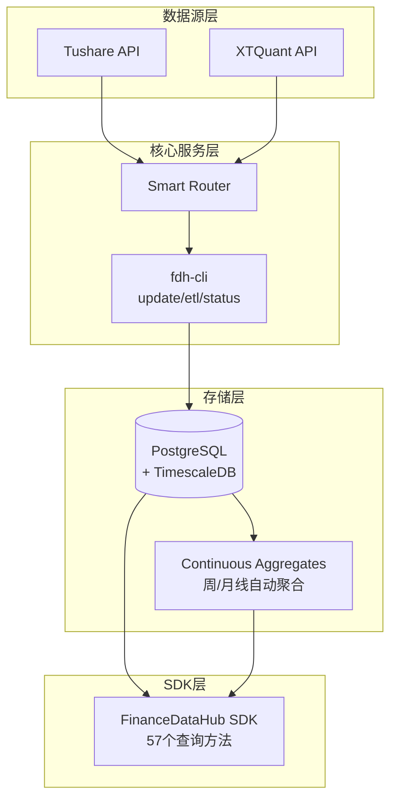
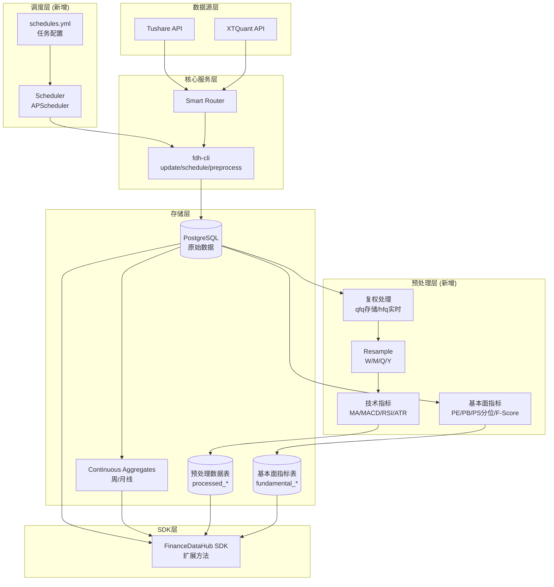

# FinanceDataHub 扩展方案 - 定时下载与数据预处理

## 概述

本方案将 FinanceDataHub 从"数据下载与存储服务"扩展为"完整数据基础设施平台"，新增三大核心能力：

1. **定时下载管理** - 支持不同 dataset 采用不同频率和参数的自动更新
2. **数据预处理** - 复权、Resample、技术指标、基本面指标等
3. **预处理数据存储** - 处理后数据的持久化与高效读取

---

## 设计决策（已确认）

| 决策项 | 选择 | 说明 |
|--------|------|------|
| 技术指标 | MA, MACD, RSI, ATR | 覆盖趋势、动量、波动三个维度 |
| 基本面指标 | PE/PB/PS分位, F-Score | 估值分位 + 财务质量评分 |
| 复权策略 | 前复权存储，后复权实时计算 | 前复权计算复杂需存储，后复权简单可实时 |
| 调度方案 | APScheduler 单进程 | 满足当前需求，简单可靠 |
| 数据初始化 | `--force` 全量，`--trade-date` 增量 | 利用现有 CLI 命令 |

---

## 现有架构分析



**现有优势**：
- ✅ 已有周/月线 Continuous Aggregates（自动维护复权价格）
- ✅ 完善的数据源路由配置 `sources.yml`
- ✅ 完整的 CLI 工具 `fdh-cli update --dataset xxx`

**待扩展**：
- ❌ 无定时任务调度能力
- ❌ SDK 不支持复权参数
- ❌ 无预处理数据存储

---

## 扩展架构设计



---

## 模块设计

### 1. 调度模块 (`scheduler/`)

#### 1.1 文件结构

```
finance_data_hub/
├── scheduler/
│   ├── __init__.py
│   ├── models.py          # 任务配置数据模型
│   ├── engine.py          # APScheduler 引擎封装
│   ├── executor.py        # 任务执行器
│   └── manager.py         # 调度管理器
└── schedules.yml          # 调度配置文件
```

#### 1.2 配置设计 (`schedules.yml`)

```yaml
# 调度配置

scheduler:
  timezone: "Asia/Shanghai"
  job_store: "postgresql"         # 任务状态持久化到 PG
  max_concurrent_jobs: 3          # 最大并发任务数
  misfire_grace_time: 300         # 错过执行的容忍时间（秒）

jobs:
  # ========== 数据下载任务 ==========
  
  # 日线数据 - 每日收盘后更新
  daily_update:
    enabled: true
    type: download
    dataset: daily
    schedule:
      type: cron
      hour: 17
      minute: 0
      day_of_week: "mon-fri"
    params:
      trade_date: "latest"        # 自动获取最新交易日
    retry:
      max_retries: 3
      delay: 300                  # 重试间隔（秒）

  # 每日基本面 - 每日收盘后更新
  daily_basic_update:
    enabled: true
    type: download
    dataset: daily_basic
    schedule:
      type: cron
      hour: 17
      minute: 30
      day_of_week: "mon-fri"
    params:
      trade_date: "latest"
    depends_on: [daily_update]    # 依赖日线更新完成

  # 复权因子 - 每日更新
  adj_factor_update:
    enabled: true
    type: download
    dataset: adj_factor
    schedule:
      type: cron
      hour: 17
      minute: 15
      day_of_week: "mon-fri"

  # 财务数据 - 每月更新（财报季更频繁）
  financial_update:
    enabled: true
    type: download
    dataset: [fina_indicator, cashflow, balancesheet, income]
    schedule:
      type: cron
      day: "1,15"                 # 每月1号和15号
      hour: 6

  # 宏观数据 - 每月更新
  macro_update:
    enabled: true
    type: download
    dataset: [gdp, ppi, m, pmi]
    schedule:
      type: cron
      day: 15
      hour: 8

  # 申万行业数据 - 每日更新
  sw_daily_update:
    enabled: true
    type: download
    dataset: sw_daily
    schedule:
      type: cron
      hour: 17
      minute: 45
      day_of_week: "mon-fri"

  # ========== 预处理任务 ==========
  
  # 技术指标预处理 - 每日运行
  technical_preprocess:
    enabled: true
    type: preprocess
    category: technical
    schedule:
      type: cron
      hour: 18
      minute: 40
      day_of_week: "mon-fri"
    params:
      all: true
      freq: "daily,weekly,monthly"
      adjust: qfq
    depends_on: [daily_update, adj_factor_update]

  # 基本面指标预处理 - 每日运行
  fundamental_preprocess:
    enabled: true
    type: preprocess
    category: fundamental
    schedule:
      type: cron
      hour: 17
      minute: 50
      day_of_week: "mon-fri"
    params:
      all: true
    depends_on: [daily_basic_update, financial_update]

  # 行业差异化估值预处理 - 每日运行
  industry_valuation_preprocess:
    enabled: true
    type: preprocess
    category: industry_valuation
    schedule:
      type: cron
      hour: 18
      minute: 0
      day_of_week: "mon-fri"
    params:
      all: true
    depends_on: [fundamental_preprocess]

  # 中国宏观周期预处理 - 每月 15 号运行
  macro_cycle_preprocess:
    enabled: true
    type: preprocess
    category: macro_cycle
    schedule:
      type: cron
      day: 15
      hour: 8
      minute: 20
    params:
      all: true
    depends_on: [macro_update, sw_member_update]
```

#### 1.3 CLI 命令扩展

```bash
# 启动调度器（守护进程模式）
fdh-cli schedule start --daemon

# 前台运行（调试用）
fdh-cli schedule start

# 停止调度器
fdh-cli schedule stop

# 查看调度状态
fdh-cli schedule status

# 立即执行特定任务
fdh-cli schedule run --job daily_update

# 查看任务历史
fdh-cli schedule history --job daily_update --limit 10

# 暂停/恢复任务
fdh-cli schedule pause --job daily_update
fdh-cli schedule resume --job daily_update

# 初始化全量数据（首次运行）
fdh-cli schedule init --full
```

---

### 2. 预处理模块 (`preprocessing/`)

#### 2.1 文件结构

```
finance_data_hub/
├── preprocessing/
│   ├── __init__.py
│   ├── adjust.py              # 复权处理
│   ├── resample.py            # 周期重采样
│   ├── technical/             # 技术指标
│   │   ├── __init__.py
│   │   ├── base.py            # 指标基类
│   │   ├── moving_average.py  # MA 系列
│   │   ├── momentum.py        # MACD, RSI
│   │   └── volatility.py      # ATR
│   ├── fundamental/           # 基本面指标
│   │   ├── __init__.py
│   │   ├── valuation.py       # PE/PB/PS 分位
│   │   ├── quality.py         # F-Score
│   │   └── industry_valuation.py
│   ├── macro/                 # 宏观周期预处理
│   │   ├── __init__.py
│   │   └── cycle.py           # 中国宏观周期 + 行业快照
│   ├── pipeline.py            # 处理流水线
│   └── storage.py             # 预处理数据存储
```

#### 2.2 宏观周期预处理

中国宏观周期预处理将现有原始宏观表 `cn_m`、`cn_ppi`、`cn_pmi`、`cn_gdp` 统一整理为月度可消费信号：

- `processed_cn_macro_cycle_phase`
  保存 `observation_time`、`time`、`credit_impulse`、`raw_phase`、`stable_phase`
- `processed_cn_macro_cycle_industry`
  保存每个申万三级行业在当月是否匹配 `raw/stable` 宏观阶段

关键口径：

- `observation_time` 为观测月，统一到月末 `15:00 Asia/Shanghai`
- `time` 为可交易生效月，整体滞后 1 个月
- `stable_phase` 采用“新阶段连续 2 个月确认才切换”的平滑规则
- `industry_config.json` 同时驱动行业估值和宏观行业快照，保证下游口径一致

#### 2.3 复权处理 (`adjust.py`)

```python
"""
复权处理模块

复权类型：
- qfq: 前复权（以最新价格为基准向前调整）- 存储
- hfq: 后复权（以上市价格为基准向后调整）- 实时计算
- none: 不复权（原始价格）

复权公式：
- 前复权: 调整价格 = 原价格 × (当日复权因子 / 最新复权因子)
- 后复权: 调整价格 = 原价格 × (当日复权因子 / 上市首日复权因子)
"""
from enum import Enum
from typing import Optional, List
import pandas as pd
import numpy as np


class AdjustType(str, Enum):
    """复权类型枚举"""
    QFQ = "qfq"    # 前复权（存储）
    HFQ = "hfq"    # 后复权（实时计算）
    NONE = "none"  # 不复权


class AdjustProcessor:
    """复权处理器"""
    
    PRICE_COLUMNS = ["open", "high", "low", "close"]
    
    def __init__(self, db_operations=None):
        self.db_operations = db_operations
        
    def adjust_qfq(
        self, 
        df: pd.DataFrame,
        price_columns: List[str] = None
    ) -> pd.DataFrame:
        """
        前复权处理（以最新价格为基准）
        
        Args:
            df: 包含 symbol, time, open, high, low, close, adj_factor 的 DataFrame
            price_columns: 需要复权的价格列
            
        Returns:
            前复权后的 DataFrame
        """
        if price_columns is None:
            price_columns = self.PRICE_COLUMNS
            
        result = df.copy()
        
        for symbol, group in result.groupby("symbol"):
            # 获取最新复权因子
            latest_factor = group["adj_factor"].iloc[-1]
            adjust_ratio = group["adj_factor"] / latest_factor
            
            for col in price_columns:
                if col in result.columns:
                    result.loc[group.index, col] = group[col] * adjust_ratio
                    
        # 标记已复权
        result["adjust_type"] = "qfq"
        return result
    
    def adjust_hfq(
        self, 
        df: pd.DataFrame,
        price_columns: List[str] = None
    ) -> pd.DataFrame:
        """
        后复权处理（以上市首日为基准）- 实时计算
        
        Args:
            df: 包含 symbol, time, open, high, low, close, adj_factor 的 DataFrame
            price_columns: 需要复权的价格列
            
        Returns:
            后复权后的 DataFrame
        """
        if price_columns is None:
            price_columns = self.PRICE_COLUMNS
            
        result = df.copy()
        
        for symbol, group in result.groupby("symbol"):
            # 获取首日复权因子
            first_factor = group["adj_factor"].iloc[0]
            adjust_ratio = group["adj_factor"] / first_factor
            
            for col in price_columns:
                if col in result.columns:
                    result.loc[group.index, col] = group[col] * adjust_ratio
                    
        result["adjust_type"] = "hfq"
        return result
        
    def adjust(
        self, 
        df: pd.DataFrame, 
        adjust_type: AdjustType = AdjustType.QFQ,
        price_columns: List[str] = None
    ) -> pd.DataFrame:
        """
        统一复权入口
        """
        if adjust_type == AdjustType.NONE:
            result = df.copy()
            result["adjust_type"] = "none"
            return result
        elif adjust_type == AdjustType.QFQ:
            return self.adjust_qfq(df, price_columns)
        else:
            return self.adjust_hfq(df, price_columns)
```

#### 2.3 技术指标

##### 2.3.1 基类 (`technical/base.py`)

```python
"""技术指标基类"""
from abc import ABC, abstractmethod
from typing import List, Any, Dict
import pandas as pd


class BaseIndicator(ABC):
    """技术指标基类"""
    
    @property
    @abstractmethod
    def name(self) -> str:
        """指标名称"""
        pass
        
    @property
    @abstractmethod
    def columns(self) -> List[str]:
        """输出列名"""
        pass
    
    @abstractmethod
    def calculate(self, df: pd.DataFrame) -> pd.DataFrame:
        """计算指标"""
        pass
        
    def __repr__(self) -> str:
        return f"{self.__class__.__name__}(name={self.name})"
```

##### 2.3.2 均线指标 (`technical/moving_average.py`)

```python
"""移动平均线指标"""
import pandas as pd
from .base import BaseIndicator


class MAIndicator(BaseIndicator):
    """简单移动平均线"""
    
    def __init__(self, period: int = 20):
        self.period = period
        
    @property
    def name(self) -> str:
        return f"ma_{self.period}"
        
    @property
    def columns(self) -> List[str]:
        return [self.name]
    
    def calculate(self, df: pd.DataFrame) -> pd.DataFrame:
        result = df.copy()
        result[self.name] = (
            df.groupby("symbol")["close"]
            .transform(lambda x: x.rolling(self.period, min_periods=1).mean())
        )
        return result


class EMAIndicator(BaseIndicator):
    """指数移动平均线"""
    
    def __init__(self, period: int = 20):
        self.period = period
        
    @property
    def name(self) -> str:
        return f"ema_{self.period}"
        
    @property
    def columns(self) -> List[str]:
        return [self.name]
    
    def calculate(self, df: pd.DataFrame) -> pd.DataFrame:
        result = df.copy()
        result[self.name] = (
            df.groupby("symbol")["close"]
            .transform(lambda x: x.ewm(span=self.period, adjust=False).mean())
        )
        return result
```

##### 2.3.3 动量指标 (`technical/momentum.py`)

```python
"""动量指标：MACD, RSI"""
import pandas as pd
import numpy as np
from .base import BaseIndicator


class MACDIndicator(BaseIndicator):
    """MACD 指标"""
    
    def __init__(self, fast: int = 12, slow: int = 26, signal: int = 9):
        self.fast = fast
        self.slow = slow
        self.signal = signal
        
    @property
    def name(self) -> str:
        return "macd"
        
    @property
    def columns(self) -> List[str]:
        return ["macd_dif", "macd_dea", "macd_hist"]
    
    def calculate(self, df: pd.DataFrame) -> pd.DataFrame:
        result = df.copy()
        
        def calc_macd(group):
            close = group["close"]
            ema_fast = close.ewm(span=self.fast, adjust=False).mean()
            ema_slow = close.ewm(span=self.slow, adjust=False).mean()
            dif = ema_fast - ema_slow
            dea = dif.ewm(span=self.signal, adjust=False).mean()
            hist = (dif - dea) * 2
            return pd.DataFrame({
                "macd_dif": dif,
                "macd_dea": dea,
                "macd_hist": hist
            }, index=group.index)
        
        macd_df = df.groupby("symbol").apply(calc_macd).reset_index(level=0, drop=True)
        result = result.join(macd_df)
        return result


class RSIIndicator(BaseIndicator):
    """RSI 相对强弱指标"""
    
    def __init__(self, period: int = 14):
        self.period = period
        
    @property
    def name(self) -> str:
        return f"rsi_{self.period}"
        
    @property
    def columns(self) -> List[str]:
        return [self.name]
    
    def calculate(self, df: pd.DataFrame) -> pd.DataFrame:
        result = df.copy()
        
        def calc_rsi(group):
            delta = group["close"].diff()
            gain = delta.where(delta > 0, 0)
            loss = (-delta).where(delta < 0, 0)
            
            avg_gain = gain.rolling(self.period, min_periods=1).mean()
            avg_loss = loss.rolling(self.period, min_periods=1).mean()
            
            rs = avg_gain / avg_loss.replace(0, np.inf)
            rsi = 100 - (100 / (1 + rs))
            return rsi
        
        result[self.name] = df.groupby("symbol").apply(
            lambda g: calc_rsi(g)
        ).reset_index(level=0, drop=True)
        
        return result
```

##### 2.3.4 波动率指标 (`technical/volatility.py`)

```python
"""波动率指标：ATR"""
import pandas as pd
import numpy as np
from .base import BaseIndicator


class ATRIndicator(BaseIndicator):
    """ATR 平均真实波幅"""
    
    def __init__(self, period: int = 14):
        self.period = period
        
    @property
    def name(self) -> str:
        return f"atr_{self.period}"
        
    @property
    def columns(self) -> List[str]:
        return [self.name]
    
    def calculate(self, df: pd.DataFrame) -> pd.DataFrame:
        result = df.copy()
        
        def calc_atr(group):
            high = group["high"]
            low = group["low"]
            close = group["close"]
            prev_close = close.shift(1)
            
            # 真实波幅 = max(high-low, |high-prev_close|, |low-prev_close|)
            tr1 = high - low
            tr2 = (high - prev_close).abs()
            tr3 = (low - prev_close).abs()
            tr = pd.concat([tr1, tr2, tr3], axis=1).max(axis=1)
            
            # ATR = TR 的 EMA
            atr = tr.ewm(span=self.period, adjust=False).mean()
            return atr
        
        result[self.name] = df.groupby("symbol").apply(
            lambda g: calc_atr(g)
        ).reset_index(level=0, drop=True)
        
        return result
```

#### 2.4 基本面指标

##### 2.4.1 估值分位 (`fundamental/valuation.py`)

```python
"""
估值指标分位计算

计算 PE/PB/PS 在历史数据中的分位数，用于判断当前估值水平。
使用滚动窗口计算，支持多个时间跨度（1年/2年/3年/5年）。
"""
import pandas as pd
import numpy as np
from typing import List, Optional


class ValuationPercentile:
    """估值分位计算器"""
    
    METRICS = ["pe_ttm", "pb", "ps_ttm"]
    DEFAULT_WINDOWS = [250, 500, 750, 1250]  # 1年/2年/3年/5年（交易日）
    
    def __init__(
        self,
        metrics: List[str] = None,
        windows: List[int] = None
    ):
        self.metrics = metrics or self.METRICS
        self.windows = windows or self.DEFAULT_WINDOWS
        
    @property
    def columns(self) -> List[str]:
        """输出列名"""
        cols = []
        for metric in self.metrics:
            for window in self.windows:
                cols.append(f"{metric}_pct_{window}d")
        return cols
    
    def calculate(self, df: pd.DataFrame) -> pd.DataFrame:
        """
        计算估值分位
        
        Args:
            df: 包含 symbol, time, pe_ttm, pb, ps_ttm 的 DataFrame
            
        Returns:
            添加分位列后的 DataFrame
        """
        result = df.copy()
        
        for metric in self.metrics:
            if metric not in df.columns:
                continue
                
            for window in self.windows:
                col_name = f"{metric}_pct_{window}d"
                
                def calc_percentile(group):
                    values = group[metric]
                    # 计算滚动分位数
                    def rolling_rank(x):
                        # 排除 NaN 和 <= 0 的值
                        valid = x[(~np.isnan(x)) & (x > 0)]
                        if len(valid) < 2:
                            return np.nan
                        current = x.iloc[-1]
                        if np.isnan(current) or current <= 0:
                            return np.nan
                        # 计算当前值在窗口中的分位
                        return (valid < current).sum() / len(valid) * 100
                    
                    return values.rolling(window, min_periods=min(20, window)).apply(
                        rolling_rank, raw=False
                    )
                
                result[col_name] = df.groupby("symbol").apply(
                    lambda g: calc_percentile(g)
                ).reset_index(level=0, drop=True)
        
        return result
```

##### 2.4.2 Piotroski F-Score (`fundamental/quality.py`)

```python
"""
Piotroski F-Score 财务质量评分

F-Score 是一个 0-9 分的评分系统，用于评估公司财务健康状况。
分为三个维度：
1. 盈利能力 (4分): ROA, CFO, ΔROA, CFO>NI
2. 财务杠杆/流动性 (3分): ΔLEVER, ΔLIQUID, EQ_OFFER
3. 运营效率 (2分): ΔMARGIN, ΔTURN

需要的财务数据：
- fina_indicator: ROA, 毛利率, 资产周转率
- balancesheet: 长期负债, 流动比率, 股本变化
- cashflow: 经营现金流
- income: 净利润
"""
import pandas as pd
import numpy as np
from typing import Optional


class FScoreCalculator:
    """Piotroski F-Score 计算器"""
    
    @property
    def columns(self) -> list[str]:
        return [
            "f_score",
            "f_roa", "f_cfo", "f_delta_roa", "f_accrual",
            "f_delta_lever", "f_delta_liquid", "f_eq_offer",
            "f_delta_margin", "f_delta_turn"
        ]
    
    def calculate(
        self,
        fina_indicator: pd.DataFrame,
        balancesheet: pd.DataFrame,
        cashflow: pd.DataFrame,
        income: pd.DataFrame
    ) -> pd.DataFrame:
        """
        计算 F-Score
        
        Args:
            fina_indicator: 财务指标数据
            balancesheet: 资产负债表数据
            cashflow: 现金流量表数据
            income: 利润表数据
            
        Returns:
            包含 F-Score 各项得分的 DataFrame
        """
        # 合并数据
        df = self._merge_financial_data(
            fina_indicator, balancesheet, cashflow, income
        )
        
        # 按股票分组计算
        result = df.groupby("ts_code").apply(self._calc_single_stock)
        return result.reset_index(drop=True)
    
    def _calc_single_stock(self, group: pd.DataFrame) -> pd.DataFrame:
        """计算单只股票的 F-Score"""
        result = group.copy()
        
        # 1. 盈利能力指标 (4分)
        # F_ROA: ROA > 0
        result["f_roa"] = (result["roa"] > 0).astype(int)
        
        # F_CFO: 经营现金流 > 0
        result["f_cfo"] = (result["n_cashflow_act"] > 0).astype(int)
        
        # F_ΔROA: ROA 同比增长
        result["f_delta_roa"] = (result["roa"].diff() > 0).astype(int)
        
        # F_ACCRUAL: 经营现金流 > 净利润
        result["f_accrual"] = (
            result["n_cashflow_act"] > result["n_income"]
        ).astype(int)
        
        # 2. 财务杠杆/流动性 (3分)
        # F_ΔLEVER: 长期负债率下降
        lever = result["lt_borr"] / result["total_assets"]
        result["f_delta_lever"] = (lever.diff() < 0).astype(int)
        
        # F_ΔLIQUID: 流动比率上升
        result["f_delta_liquid"] = (
            result["current_ratio"].diff() > 0
        ).astype(int)
        
        # F_EQ_OFFER: 未增发新股
        result["f_eq_offer"] = (
            result["total_share"].diff() <= 0
        ).astype(int)
        
        # 3. 运营效率 (2分)
        # F_ΔMARGIN: 毛利率上升
        result["f_delta_margin"] = (
            result["grossprofit_margin"].diff() > 0
        ).astype(int)
        
        # F_ΔTURN: 资产周转率上升
        result["f_delta_turn"] = (
            result["assets_turn"].diff() > 0
        ).astype(int)
        
        # 总分
        f_cols = [
            "f_roa", "f_cfo", "f_delta_roa", "f_accrual",
            "f_delta_lever", "f_delta_liquid", "f_eq_offer",
            "f_delta_margin", "f_delta_turn"
        ]
        result["f_score"] = result[f_cols].sum(axis=1)
        
        return result
    
    def _merge_financial_data(
        self,
        fina_indicator: pd.DataFrame,
        balancesheet: pd.DataFrame,
        cashflow: pd.DataFrame,
        income: pd.DataFrame
    ) -> pd.DataFrame:
        """合并财务数据"""
        # 提取需要的列
        fina_cols = [
            "ts_code", "end_date_time", "roa", 
            "grossprofit_margin", "assets_turn", "current_ratio"
        ]
        bs_cols = ["ts_code", "end_date_time", "lt_borr", "total_assets", "total_share"]
        cf_cols = ["ts_code", "end_date_time", "n_cashflow_act"]
        inc_cols = ["ts_code", "end_date_time", "n_income"]
        
        # 合并
        df = fina_indicator[fina_cols].merge(
            balancesheet[bs_cols], on=["ts_code", "end_date_time"], how="left"
        ).merge(
            cashflow[cf_cols], on=["ts_code", "end_date_time"], how="left"
        ).merge(
            income[inc_cols], on=["ts_code", "end_date_time"], how="left"
        )
        
        return df.sort_values(["ts_code", "end_date_time"])
```

---

### 3. 存储设计 - 预处理数据表

#### 3.1 新增数据库表

```sql
-- ============================================================================
-- 预处理日线数据表（前复权 + 技术指标）
-- ============================================================================

CREATE TABLE IF NOT EXISTS processed_daily_qfq (
    time TIMESTAMPTZ NOT NULL,
    symbol VARCHAR(20) NOT NULL,
    -- OHLCV（前复权）
    open DECIMAL(20,4),
    high DECIMAL(20,4),
    low DECIMAL(20,4),
    close DECIMAL(20,4),
    volume BIGINT,
    amount DECIMAL(20,4),
    -- 均线指标
    ma_5 DECIMAL(20,4),
    ma_10 DECIMAL(20,4),
    ma_20 DECIMAL(20,4),
    ma_60 DECIMAL(20,4),
    ma_120 DECIMAL(20,4),
    ma_250 DECIMAL(20,4),
    -- MACD
    macd_dif DECIMAL(20,6),
    macd_dea DECIMAL(20,6),
    macd_hist DECIMAL(20,6),
    -- RSI
    rsi_6 DECIMAL(10,4),
    rsi_14 DECIMAL(10,4),
    -- ATR
    atr_14 DECIMAL(20,4),
    -- 元数据
    processed_at TIMESTAMPTZ DEFAULT NOW(),
    PRIMARY KEY (symbol, time)
);

SELECT create_hypertable('processed_daily_qfq', 'time', if_not_exists => TRUE);

CREATE INDEX IF NOT EXISTS idx_processed_daily_qfq_symbol 
    ON processed_daily_qfq (symbol, time DESC);

COMMENT ON TABLE processed_daily_qfq IS '预处理日线数据表（前复权 + 技术指标）';

-- ============================================================================
-- 预处理周线数据表（前复权 + 技术指标）
-- ============================================================================

CREATE TABLE IF NOT EXISTS processed_weekly_qfq (
    time TIMESTAMPTZ NOT NULL,
    symbol VARCHAR(20) NOT NULL,
    -- OHLCV（前复权）
    open DECIMAL(20,4),
    high DECIMAL(20,4),
    low DECIMAL(20,4),
    close DECIMAL(20,4),
    volume BIGINT,
    amount DECIMAL(20,4),
    -- 均线指标
    ma_5 DECIMAL(20,4),
    ma_10 DECIMAL(20,4),
    ma_20 DECIMAL(20,4),
    ma_60 DECIMAL(20,4),
    -- MACD
    macd_dif DECIMAL(20,6),
    macd_dea DECIMAL(20,6),
    macd_hist DECIMAL(20,6),
    -- RSI & ATR
    rsi_14 DECIMAL(10,4),
    atr_14 DECIMAL(20,4),
    -- 元数据
    processed_at TIMESTAMPTZ DEFAULT NOW(),
    PRIMARY KEY (symbol, time)
);

SELECT create_hypertable('processed_weekly_qfq', 'time', if_not_exists => TRUE);

COMMENT ON TABLE processed_weekly_qfq IS '预处理周线数据表（前复权 + 技术指标）';

-- ============================================================================
-- 预处理月线数据表（前复权 + 技术指标）
-- ============================================================================

CREATE TABLE IF NOT EXISTS processed_monthly_qfq (
    time TIMESTAMPTZ NOT NULL,
    symbol VARCHAR(20) NOT NULL,
    -- OHLCV（前复权）
    open DECIMAL(20,4),
    high DECIMAL(20,4),
    low DECIMAL(20,4),
    close DECIMAL(20,4),
    volume BIGINT,
    amount DECIMAL(20,4),
    -- 均线指标
    ma_5 DECIMAL(20,4),
    ma_10 DECIMAL(20,4),
    ma_20 DECIMAL(20,4),
    -- MACD
    macd_dif DECIMAL(20,6),
    macd_dea DECIMAL(20,6),
    macd_hist DECIMAL(20,6),
    -- RSI & ATR
    rsi_14 DECIMAL(10,4),
    atr_14 DECIMAL(20,4),
    -- 元数据
    processed_at TIMESTAMPTZ DEFAULT NOW(),
    PRIMARY KEY (symbol, time)
);

SELECT create_hypertable('processed_monthly_qfq', 'time', if_not_exists => TRUE);

COMMENT ON TABLE processed_monthly_qfq IS '预处理月线数据表（前复权 + 技术指标）';

-- ============================================================================
-- 基本面指标表（估值分位 + F-Score）
-- ============================================================================

CREATE TABLE IF NOT EXISTS processed_valuation_pct (
    time TIMESTAMPTZ NOT NULL,                    -- 交易日期
    symbol VARCHAR(20) NOT NULL,                   -- 股票代码
    -- 估值分位（1年窗口）
    pe_ttm_pct_250d DECIMAL(10,4),
    pb_pct_250d DECIMAL(10,4),
    ps_ttm_pct_250d DECIMAL(10,4),
    -- 估值分位（2年窗口）
    pe_ttm_pct_500d DECIMAL(10,4),
    pb_pct_500d DECIMAL(10,4),
    ps_ttm_pct_500d DECIMAL(10,4),
    -- 估值分位（3年窗口）
    pe_ttm_pct_750d DECIMAL(10,4),
    pb_pct_750d DECIMAL(10,4),
    ps_ttm_pct_750d DECIMAL(10,4),
    -- 估值分位（5年窗口）
    pe_ttm_pct_1250d DECIMAL(10,4),
    pb_pct_1250d DECIMAL(10,4),
    ps_ttm_pct_1250d DECIMAL(10,4),
    -- F-Score（季度更新，存储最新季度值）
    f_score SMALLINT,
    f_roa SMALLINT,
    f_cfo SMALLINT,
    f_delta_roa SMALLINT,
    f_accrual SMALLINT,
    f_delta_lever SMALLINT,
    f_delta_liquid SMALLINT,
    f_eq_offer SMALLINT,
    f_delta_margin SMALLINT,
    f_delta_turn SMALLINT,
    -- 元数据
    processed_at TIMESTAMPTZ DEFAULT NOW(),
    PRIMARY KEY (symbol, time)
);

SELECT create_hypertable('processed_valuation_pct', 'time', if_not_exists => TRUE);

CREATE INDEX IF NOT EXISTS idx_fundamental_symbol 
    ON processed_valuation_pct (symbol, time DESC);

COMMENT ON TABLE processed_valuation_pct IS '基本面指标表（估值分位 + F-Score）';
COMMENT ON COLUMN processed_valuation_pct.pe_ttm_pct_250d IS 'PE_TTM 1年历史分位 (0-100)';
COMMENT ON COLUMN processed_valuation_pct.f_score IS 'Piotroski F-Score (0-9)';

-- ============================================================================
-- 预处理任务执行记录表
-- ============================================================================

CREATE TABLE IF NOT EXISTS preprocess_execution_log (
    id SERIAL PRIMARY KEY,
    job_id VARCHAR(100) NOT NULL,
    job_name VARCHAR(100) NOT NULL,
    job_type VARCHAR(50) NOT NULL,             -- download, preprocess
    status VARCHAR(20) NOT NULL,               -- pending, running, completed, failed
    start_time TIMESTAMPTZ NOT NULL,
    end_time TIMESTAMPTZ,
    symbols_count INT,
    records_processed INT,
    error_message TEXT,
    config JSONB,                              -- 任务配置快照
    created_at TIMESTAMPTZ DEFAULT NOW()
);

CREATE INDEX IF NOT EXISTS idx_preprocess_log_job ON preprocess_execution_log (job_id);
CREATE INDEX IF NOT EXISTS idx_preprocess_log_status ON preprocess_execution_log (status);
CREATE INDEX IF NOT EXISTS idx_preprocess_log_time ON preprocess_execution_log (start_time DESC);

COMMENT ON TABLE preprocess_execution_log IS '预处理任务执行记录表';
```

---

### 4. SDK 扩展

#### 4.1 新增查询方法

```python
class FinanceDataHub:
    """扩展的 SDK 方法"""
    
    # ========== 复权数据查询 ==========
    
    def get_daily_adjusted(
        self,
        symbols: Optional[List[str]] = None,
        start_date: Optional[str] = None,
        end_date: Optional[str] = None,
        adjust: str = "qfq"  # 新增参数
    ) -> pd.DataFrame:
        """
        获取复权日线数据
        
        Args:
            symbols: 股票代码列表
            start_date: 开始日期
            end_date: 结束日期
            adjust: 复权类型
                - 'qfq': 前复权（默认，从预处理表读取）
                - 'hfq': 后复权（实时计算）
                - 'none': 不复权
                
        Returns:
            复权后的日线数据
            
        Example:
            >>> fdh.get_daily_adjusted(
            ...     symbols=['600519.SH'],
            ...     start_date='2024-01-01',
            ...     adjust='qfq'
            ... )
        """
        if adjust == "qfq":
            # 从预处理表读取
            return self._query_processed_daily(symbols, start_date, end_date)
        elif adjust == "hfq":
            # 实时计算后复权
            df = self.get_daily(symbols, start_date, end_date)
            return self._adjust_processor.adjust_hfq(df)
        else:
            return self.get_daily(symbols, start_date, end_date)
    
    # ========== 预处理数据查询 ==========
    
    def get_processed_daily(
        self,
        symbols: Optional[List[str]] = None,
        start_date: Optional[str] = None,
        end_date: Optional[str] = None,
        indicators: Optional[List[str]] = None  # 指定返回的指标
    ) -> pd.DataFrame:
        """
        获取预处理的日线数据（前复权 + 技术指标）
        
        Args:
            symbols: 股票代码列表
            start_date: 开始日期
            end_date: 结束日期
            indicators: 需要的指标列表，None 表示全部
                可选: ma_5, ma_10, ma_20, ma_60, ma_120, ma_250,
                      macd_dif, macd_dea, macd_hist, rsi_6, rsi_14, atr_14
                
        Returns:
            预处理后的日线数据
            
        Example:
            >>> fdh.get_processed_daily(
            ...     symbols=['600519.SH'],
            ...     start_date='2024-01-01',
            ...     indicators=['ma_20', 'macd_dif', 'rsi_14']
            ... )
        """
        ...
        
    def get_processed_weekly(
        self,
        symbols: Optional[List[str]] = None,
        start_date: Optional[str] = None,
        end_date: Optional[str] = None,
        indicators: Optional[List[str]] = None
    ) -> pd.DataFrame:
        """获取预处理的周线数据（前复权 + 技术指标）"""
        ...
        
    def get_processed_monthly(
        self,
        symbols: Optional[List[str]] = None,
        start_date: Optional[str] = None,
        end_date: Optional[str] = None,
        indicators: Optional[List[str]] = None
    ) -> pd.DataFrame:
        """获取预处理的月线数据（前复权 + 技术指标）"""
        ...
    
    # ========== 基本面指标查询 ==========
    
    def get_processed_valuation_pct(
        self,
        symbols: Optional[List[str]] = None,
        start_date: Optional[str] = None,
        end_date: Optional[str] = None,
        indicators: Optional[List[str]] = None
    ) -> pd.DataFrame:
        """
        获取基本面指标（估值分位 + F-Score）
        
        Args:
            symbols: 股票代码列表
            start_date: 开始日期
            end_date: 结束日期
            indicators: 指标列表，None 表示全部
                估值分位: pe_ttm_pct_250d, pb_pct_250d, ps_ttm_pct_250d, ...
                F-Score: f_score, f_roa, f_cfo, ...
                
        Returns:
            基本面指标数据
            
        Example:
            >>> fdh.get_processed_valuation_pct(
            ...     symbols=['600519.SH'],
            ...     start_date='2024-01-01',
            ...     indicators=['pe_ttm_pct_250d', 'f_score']
            ... )
        """
        ...
        
    # ========== 实时计算（不存储） ==========
    
    def calculate_indicators(
        self,
        df: pd.DataFrame,
        indicators: List[str]
    ) -> pd.DataFrame:
        """
        对给定数据计算技术指标（不存储）
        
        适用于临时分析场景
        
        Args:
            df: OHLCV DataFrame（需已复权）
            indicators: 指标列表
            
        Returns:
            添加指标列后的 DataFrame
            
        Example:
            >>> raw = fdh.get_daily_adjusted(symbols=['600519.SH'], adjust='hfq')
            >>> with_ind = fdh.calculate_indicators(raw, ['ma_20', 'rsi_14'])
        """
        ...
```

---

## 实施计划

### Phase 4.1: 调度模块（1-2 周）

| 任务 | 优先级 | 工作量 |
|------|--------|--------|
| 设计 `schedules.yml` 配置格式 | P0 | 0.5d |
| 实现 `scheduler/models.py` 数据模型 | P0 | 0.5d |
| 实现 `scheduler/engine.py` APScheduler 封装 | P0 | 1d |
| 实现 `scheduler/executor.py` 任务执行器 | P0 | 1d |
| 实现 `scheduler/manager.py` 调度管理器 | P0 | 1d |
| 扩展 CLI `fdh-cli schedule` 命令 | P0 | 1d |
| 编写调度模块测试 | P1 | 1d |
| 编写调度模块文档 | P1 | 0.5d |

### Phase 4.2: 预处理模块（2 周）

| 任务 | 优先级 | 工作量 |
|------|--------|--------|
| 实现 `preprocessing/adjust.py` 复权处理 | P0 | 0.5d |
| 实现 `preprocessing/resample.py` 周期重采样 | P0 | 0.5d |
| 实现 `preprocessing/technical/` 技术指标 (MA/MACD/RSI/ATR) | P0 | 2d |
| 实现 `preprocessing/fundamental/valuation.py` 估值分位 | P0 | 1d |
| 实现 `preprocessing/fundamental/quality.py` F-Score | P0 | 1d |
| 实现 `preprocessing/pipeline.py` 处理流水线 | P0 | 1d |
| 创建预处理数据表 SQL | P0 | 0.5d |
| 实现 `preprocessing/storage.py` 存储管理 | P0 | 1d |
| 扩展 CLI `fdh-cli preprocess` 命令 | P1 | 1d |
| 编写预处理模块测试 | P1 | 1d |

### Phase 4.3: SDK 扩展（1 周）

| 任务 | 优先级 | 工作量 |
|------|--------|--------|
| 实现 `get_daily_adjusted()` | P0 | 0.5d |
| 实现 `get_processed_daily/weekly/monthly()` | P0 | 1d |
| 实现 `get_processed_valuation_pct()` | P0 | 0.5d |
| 实现 `calculate_indicators()` 实时计算 | P1 | 0.5d |
| 更新 SDK 文档 | P1 | 0.5d |
| 编写 SDK 扩展测试 | P1 | 0.5d |

---

## 使用示例

### 初始化与调度

```bash
# 首次全量数据初始化
fdh-cli update --dataset daily --force
fdh-cli update --dataset daily_basic --force
fdh-cli update --dataset adj_factor --force
fdh-cli update --dataset fina_indicator --force
# ... 其他 dataset

# 首次预处理
fdh-cli preprocess run --category technical --all
fdh-cli preprocess run --category fundamental --all
fdh-cli preprocess run --category quarterly_fundamental --all
fdh-cli preprocess run --category industry_valuation --all
fdh-cli preprocess run --category macro_cycle

# 启动调度器（后台运行）
fdh-cli schedule start --daemon

# 查看运行状态
fdh-cli schedule status
```

### SDK 使用

```python
from finance_data_hub import FinanceDataHub

fdh = FinanceDataHub(settings)

# 1. 获取前复权日线数据（从预处理表）
daily_qfq = fdh.get_daily_adjusted(
    symbols=['600519.SH', '000858.SZ'],
    start_date='2024-01-01',
    adjust='qfq'
)

# 2. 获取后复权日线数据（实时计算）
daily_hfq = fdh.get_daily_adjusted(
    symbols=['600519.SH'],
    start_date='2024-01-01',
    adjust='hfq'
)

# 3. 获取预处理数据（含技术指标）
processed = fdh.get_processed_daily(
    symbols=['600519.SH'],
    start_date='2024-01-01',
    indicators=['ma_20', 'ma_60', 'macd_dif', 'rsi_14', 'atr_14']
)

# 4. 获取基本面指标
fundamental = fdh.get_processed_valuation_pct(
    symbols=['600519.SH'],
    start_date='2024-01-01',
    indicators=['pe_ttm_pct_250d', 'f_score']
)

# 5. 获取中国宏观周期（月度）
macro_cycle = fdh.get_cn_macro_cycle(
    start_date='2024-01-01',
    phase_mode='stable'
)

# 6. 获取当前宏观阶段下的优先行业
preferred_industries = fdh.get_cn_macro_cycle_industries(
    preferred_only=True,
    phase_mode='stable'
)

# 7. 实时计算指标（不存储）
raw_data = fdh.get_daily_adjusted(symbols=['600519.SH'], adjust='hfq')
with_indicators = fdh.calculate_indicators(
    raw_data, 
    indicators=['ma_5', 'ma_10', 'macd']
)
```

---

## 验证计划

### 自动化测试

```bash
# 运行单元测试
pytest tests/test_scheduler.py -v
pytest tests/test_preprocessing.py -v
pytest tests/test_sdk_extended.py -v

# 运行集成测试
pytest tests/integration/test_full_pipeline.py -v
```

### 手动验证

1. **调度器功能**
   - 启动调度器，验证任务按时执行
   - 测试任务依赖关系
   - 测试失败重试机制

2. **复权正确性**
   - 对比前复权价格与 Tushare `pro.daily(adj='qfq')` 结果
   - 验证后复权实时计算正确性

3. **技术指标正确性**
   - 对比 MA/MACD/RSI/ATR 与主流软件（如同花顺）计算结果
   
4. **基本面指标正确性**
   - 验证估值分位计算逻辑
   - F-Score 与手工计算对比

5. **性能测试**
   - 全市场日线预处理耗时（预计 10-30 分钟）
   - 预处理数据查询响应时间（预计 < 100ms）

---

## 风险与注意事项

> [!WARNING]
> **前复权价格更新策略**
> 
> 前复权价格会随新的除权除息事件变化（最新复权因子改变）。建议：
> - 每日增量更新时，重新计算全部历史数据的前复权价格
> - 或者记录基准复权因子，查询时动态调整
> - 当前方案采用每日全量重算，确保一致性

> [!IMPORTANT]
> **F-Score 数据滞后性**
> 
> 财务数据按季度披露，存在披露滞后：
> - Q1 报告：4月30日前
> - Q2 报告：8月31日前
> - Q3 报告：10月31日前
> - 年报：4月30日前
> 
> F-Score 使用最新可用的财务数据计算。

> [!NOTE]
> **存储空间估算**
> 
> | 表名 | 预估大小 | 说明 |
> |------|----------|------|
> | processed_daily_qfq | ~10GB | 5000股×20年×~100字节/行 |
> | processed_weekly_qfq | ~2GB | 日线的 1/5 |
> | processed_monthly_qfq | ~0.5GB | 日线的 1/20 |
> | processed_valuation_pct | ~5GB | 5000股×20年×~50字节/行 |
